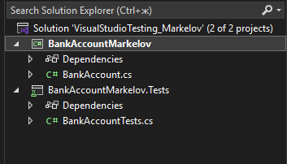
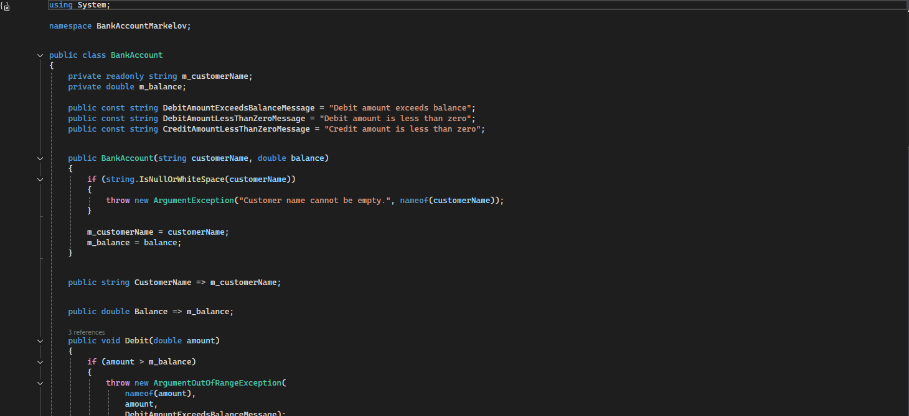
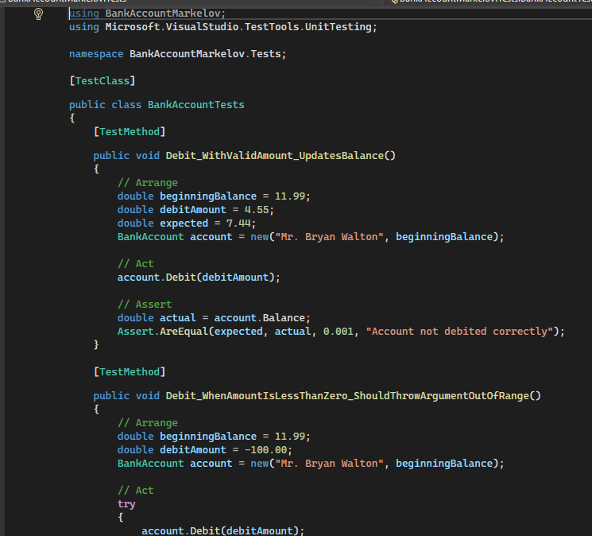
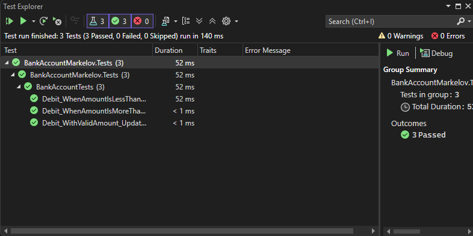

# ПРАКТИЧЕСКАЯ РАБОТА №1
## Средства тестирования Visual Studio 2022. Тестирование класса `BankAccount`

---

<p align="center">
Министерство науки и высшего образования Российской Федерации  
<br>
[УКАЗАТЬ ПОЛНОЕ НАЗВАНИЕ ОБРАЗОВАТЕЛЬНОЙ ОРГАНИЗАЦИИ]  
<br>
[УКАЗАТЬ ИНСТИТУТ / ФАКУЛЬТЕТ / ОТДЕЛЕНИЕ]  
<br>
[УКАЗАТЬ КАФЕДРУ]
</p>

<br><br><br>

<p align="center">
<b>СОПРОВОДИТЕЛЬНАЯ ЗАПИСКА</b>  
<br>
к практической работе №1
</p>

<br><br>

<p align="center">
по дисциплине: <b>[УКАЗАТЬ НАЗВАНИЕ ДИСЦИПЛИНЫ]</b>
</p>

<br><br>

<p align="right">
Выполнил: студент группы <b>ИПО-21</b>  
<br>
<b>Маркелов Игорь Вячеславович</b>
<br><br>
Проверил: <b>[ФИО ПРЕПОДАВАТЕЛЯ]</b>
</p>

<br><br><br><br>

<p align="center">
[ГОРОД] — 2026
</p>

---

# Оглавление

- [Введение](#введение)
- [1. Цель работы](#1-цель-работы)
- [2. Постановка задачи](#2-постановка-задачи)
- [3. Используемые средства и среда разработки](#3-используемые-средства-и-среда-разработки)
- [4. Краткие теоретические сведения](#4-краткие-теоретические-сведения)
- [5. Ход выполнения практической работы](#5-ход-выполнения-практической-работы)
  - [5.1. Подготовка среды разработки](#51-подготовка-среды-разработки)
  - [5.2. Создание основного проекта](#52-создание-основного-проекта)
  - [5.3. Реализация класса `BankAccount`](#53-реализация-класса-bankaccount)
  - [5.4. Создание тестового проекта](#54-создание-тестового-проекта)
  - [5.5. Реализация модульных тестов](#55-реализация-модульных-тестов)
  - [5.6. Запуск тестов в Visual Studio 2022](#56-запуск-тестов-в-visual-studio-2022)
  - [5.7. Анализ результатов тестирования](#57-анализ-результатов-тестирования)
  - [5.8. Рефакторинг тестируемого кода](#58-рефакторинг-тестируемого-кода)
- [6. Полученные результаты](#6-полученные-результаты)
- [7. Размещение проекта на GitHub](#7-размещение-проекта-на-github)
- [8. Подготовка и отправка работы преподавателю](#8-подготовка-и-отправка-работы-преподавателю)
- [Заключение](#заключение)
- [Список использованных источников](#список-использованных-источников)
- [Приложения](#приложения)

---

# Введение

Практическая работа №1 посвящена изучению встроенных средств тестирования в среде **Microsoft Visual Studio 2022**. В рамках работы выполняется создание и запуск модульных тестов для класса `BankAccount`, а также анализ и корректировка тестируемого кода на основе результатов тестирования.

Согласно методическому руководству **«Средства тестирования Visual Studio-2022»** (стр. 158–170), в работе рассматривается пошаговый процесс:

- создания тестового проекта;
- написания модульных тестов;
- запуска тестов через окно **Обозреватель тестов**;
- обнаружения ошибки в методе `Debit`;
- исправления кода;
- повторного запуска тестов;
- повышения информативности тестов и исключений.

В ходе выполнения работы формируются практические навыки использования фреймворка модульного тестирования, анализа поведения программного кода и повышения качества программного продукта за счёт автоматизированной проверки.

---

# 1. Цель работы

Целью практической работы является освоение средств модульного тестирования в **Microsoft Visual Studio 2022**, получение практических навыков создания тестов, запуска тестов и анализа их результатов на примере класса `BankAccount`.

---

# 2. Постановка задачи

В соответствии с заданием необходимо:

1. Выполнить практическую работу №1 по руководству **«Средства тестирования Visual Studio-2022»**, стр. **158–170**.
2. Реализовать проект с классом `BankAccount`.
3. Создать модульные тесты для проверки поведения метода `Debit`.
4. Проверить три основных сценария работы метода:
   - корректное уменьшение баланса при допустимой сумме списания;
   - выброс исключения `ArgumentOutOfRangeException`, если сумма меньше нуля;
   - выброс исключения `ArgumentOutOfRangeException`, если сумма превышает баланс.
5. Выполнить запуск тестов через **Обозреватель тестов**.
6. Исправить найденные ошибки и повторно запустить тесты.
7. Подготовить сопроводительную записку.
8. Разместить исходный код и PDF-файл записки на GitHub.
9. Отправить преподавателю ссылку на репозиторий.

---

# 3. Используемые средства и среда разработки

При выполнении работы использовались следующие программные и технические средства:

- **Операционная система:** Windows 11
- **Среда разработки:** Microsoft Visual Studio 2022
- **Язык программирования:** C#
- **Платформа:** .NET 9
- **SDK:** .NET SDK 9.0
- **Система модульного тестирования:** MSTest
- **Средства запуска тестов:** Test Explorer (Обозреватель тестов)
- **Система контроля версий:** Git
- **Платформа размещения проекта:** GitHub

Для корректной работы проекта в Visual Studio 2022 рекомендуется установленная рабочая нагрузка:

- **.NET desktop development**

---

# 4. Краткие теоретические сведения

Модульное тестирование — это способ проверки корректности отдельных частей программы, например методов, классов или логических компонентов. Основная идея заключается в том, чтобы тестировать небольшие фрагменты кода независимо от остальной системы.

Средства тестирования в **Visual Studio 2022** позволяют:

- создавать отдельные тестовые проекты;
- писать модульные тесты с использованием тестовых атрибутов;
- запускать тесты через **Обозреватель тестов**;
- анализировать успешные и неуспешные тесты;
- получать сообщения об ошибках;
- повторно запускать тесты после исправления кода.

В рамках данной работы используются следующие элементы MSTest:

- атрибут `[TestClass]` для обозначения класса с тестами;
- атрибут `[TestMethod]` для обозначения отдельного тестового метода;
- методы утверждений:
  - `Assert.AreEqual`;
  - `Assert.Fail`;
  - `StringAssert.Contains`.

Согласно методическим указаниям, тестовый метод должен удовлетворять следующим требованиям:

- быть помечен атрибутом `[TestMethod]`;
- возвращать `void`;
- не принимать параметров.

---

# 5. Ход выполнения практической работы

## 5.1. Подготовка среды разработки

На первом этапе была подготовлена рабочая среда:

1. Запущена **Microsoft Visual Studio 2022**.
2. Проверено наличие компонентов для разработки на C# и .NET.
3. Уточнена установленная версия платформы **.NET 9**.
4. Подготовлена рабочая папка проекта.
5. Подготовлен каталог для дальнейшей публикации результатов на GitHub.



---

## 5.2. Создание основного проекта

На следующем этапе был создан основной проект, содержащий тестируемый класс `BankAccount`.

В ходе выполнения работы:

1. Был создан проект типа **Class Library**.
2. Проекту присвоено имя **BankAccountMarkelov**.
3. В проект добавлен класс `BankAccount`.
4. Реализованы свойства и методы, необходимые для моделирования банковского счёта.

Структура решения включает основной проект и тестовый проект, добавленный позже.


---

## 5.3. Реализация класса `BankAccount`

В основном проекте был реализован класс `BankAccount`, предназначенный для моделирования банковского счёта.

Класс содержит:

- имя владельца счёта;
- текущий баланс;
- метод `Debit(double amount)` для списания средств;
- метод `Credit(double amount)` для пополнения счёта;
- константы сообщений об ошибках.

В соответствии с руководством метод `Debit` должен:

1. уменьшать баланс при корректной сумме списания;
2. выбрасывать исключение, если сумма меньше нуля;
3. выбрасывать исключение, если сумма превышает баланс.

На первом этапе в методе могла присутствовать логическая ошибка, при которой вместо вычитания суммы происходило её прибавление к балансу. Модульное тестирование позволяет обнаружить такую ошибку.

Пример логики корректного метода `Debit`:

```csharp
if (amount > m_balance)
{
    throw new ArgumentOutOfRangeException(
        nameof(amount),
        amount,
        DebitAmountExceedsBalanceMessage);
}

if (amount < 0)
{
    throw new ArgumentOutOfRangeException(
        nameof(amount),
        amount,
        DebitAmountLessThanZeroMessage);
}

m_balance -= amount;
```



---

## 5.4. Создание тестового проекта

После создания основного проекта был добавлен тестовый проект.

Последовательность действий:

1. В решение был добавлен новый проект тестов.
2. Выбран шаблон **MSTest Test Project**.
3. Тестовому проекту присвоено имя **BankAccountMarkelov.Tests**.
4. В тестовый проект была добавлена ссылка на основной проект **BankAccountMarkelov**.
5. Создан тестовый класс `BankAccountTests`.

Тестовый проект предназначен для независимой проверки поведения метода `Debit`.


---

## 5.5. Реализация модульных тестов

В тестовом классе `BankAccountTests` были реализованы модульные тесты, описанные в методических указаниях.

### Тест 1. Проверка корректного списания средств

Метод:

`Debit_WithValidAmount_UpdatesBalance`

Назначение:
проверяет, что при допустимой сумме списания баланс уменьшается на требуемую величину.

Пример логики теста:

1. Создаётся объект `BankAccount` с начальным балансом `11.99`.
2. Выполняется списание `4.55`.
3. Проверяется, что итоговый баланс равен `7.44`.

Для проверки результата используется метод:

- `Assert.AreEqual(expected, actual, 0.001, "...")`

### Тест 2. Проверка отрицательной суммы списания

Метод:

`Debit_WhenAmountIsLessThanZero_ShouldThrowArgumentOutOfRange`

Назначение:
проверяет, что при отрицательной сумме списания создаётся исключение `ArgumentOutOfRangeException`.

В окончательной версии теста используется блок `try/catch`, а также проверка содержимого сообщения исключения с помощью:

- `StringAssert.Contains`

### Тест 3. Проверка списания суммы, превышающей баланс

Метод:

`Debit_WhenAmountIsMoreThanBalance_ShouldThrowArgumentOutOfRange`

Назначение:
проверяет, что при попытке списать сумму, превышающую остаток на счёте, создаётся исключение `ArgumentOutOfRangeException`.

В улучшенной версии теста:

- исключение перехватывается в блоке `catch`;
- анализируется его сообщение;
- если исключение не было выброшено, вызывается:
  - `Assert.Fail("The expected exception was not thrown.")`



---

## 5.6. Запуск тестов в Visual Studio 2022

После написания тестов был выполнен их запуск через окно **Обозреватель тестов**.

Порядок запуска:

1. Выполнена команда **Build Solution**.
2. Открыто окно:
   - **Тест → Windows → Обозреватель тестов**
3. Нажата кнопка:
   - **Run All**

В процессе выполнения тестов в верхней части окна отображается строка состояния:

- зелёная — если все тесты пройдены успешно;
- красная — если хотя бы один тест завершился с ошибкой.

На первом этапе тест `Debit_WithValidAmount_UpdatesBalance` должен был выявить ошибку в коде, если сумма списания прибавлялась к балансу вместо вычитания.



---

## 5.7. Анализ результатов тестирования

В результате выполнения тестов было установлено, что первоначальная реализация метода `Debit` содержала логическую ошибку.

Ошибка заключалась в том, что сумма списания:

- **добавлялась** к балансу;
- вместо того чтобы **вычитаться**.

Некорректная строка:

```csharp
m_balance += amount;
```

После анализа результатов тестирования эта строка была исправлена на:

```csharp
m_balance -= amount;
```

После исправления кода тесты были повторно запущены.

Кроме того, был проведён анализ качества самих тестов. Было замечено, что при использовании только `Assert.ThrowsException` нельзя точно определить, какое именно условие в методе вызвало исключение. Поэтому тестируемый код и тестовые методы были улучшены.

---

## 5.8. Рефакторинг тестируемого кода

Для повышения информативности исключений в классе `BankAccount` были добавлены константы сообщений об ошибках:

```csharp
public const string DebitAmountExceedsBalanceMessage = "Debit amount exceeds balance";
public const string DebitAmountLessThanZeroMessage = "Debit amount is less than zero";
```

Затем в методе `Debit` вместо простого конструктора `ArgumentOutOfRangeException("amount")` был использован более подробный конструктор:

```csharp
ArgumentOutOfRangeException(String, Object, String)
```

Это позволило включить в исключение:

- имя аргумента;
- значение аргумента;
- пользовательское сообщение.

После этого тестовые методы были переработаны:

- исключение стало перехватываться через `try/catch`;
- выполнялась проверка текста сообщения;
- после успешной проверки выполнялся `return`;
- если исключение не было создано, вызывался `Assert.Fail`.

Окончательная версия тестов стала более надёжной и информативной.


---

# 6. Полученные результаты

В результате выполнения практической работы были получены следующие результаты:

- изучены средства тестирования **Visual Studio 2022**;
- создан основной проект с классом `BankAccount`;
- создан тестовый проект на базе **MSTest**;
- реализованы три теста для метода `Debit`;
- обнаружена логическая ошибка в методе списания средств;
- ошибка была исправлена;
- тестируемый код был улучшен за счёт более информативных исключений;
- тестовые методы были переработаны и стали более надёжными;
- подтверждена корректность поведения метода `Debit` после исправления кода.

---

# 7. Размещение проекта на GitHub

После завершения практической части исходный код проекта и сопроводительная записка подлежат размещению на **GitHub**.

В репозиторий рекомендуется включить:

- solution-файл `.sln`;
- основной проект `BankAccountMarkelov`;
- тестовый проект `BankAccountMarkelov.Tests`;
- файл `README.md`;
- папку `docs`;
- итоговую записку в формате **PDF**.

Не рекомендуется включать:

- `bin/`
- `obj/`
- `.vs/`
- временные пользовательские файлы Visual Studio

Рекомендуемое имя репозитория:

```text
practice-1-visual-studio-testing-markelov
```

Ссылка на репозиторий:

**[ВСТАВИТЬ ССЫЛКУ НА GITHUB]**

---

# 8. Подготовка и отправка работы преподавателю

После публикации проекта на GitHub необходимо отправить ссылку на репозиторий на адрес:

```text
crhunta@outlook.com
```

### Тема письма

Согласно выданным требованиям, тема письма должна содержать группу и ФИО студента:

```text
ИПО-21, Маркелов Игорь Вячеславович
```

### Пример текста письма

```text
Здравствуйте!

Направляю ссылку на репозиторий GitHub с выполненной практической работой №1.

Студент: Маркелов Игорь Вячеславович
Группа: ИПО-21

Ссылка на репозиторий:
[вставить ссылку]

С уважением,
Маркелов Игорь Вячеславович
```

---

# Заключение

В ходе выполнения практической работы были изучены и применены средства тестирования **Microsoft Visual Studio 2022**. На примере класса `BankAccount` был реализован набор модульных тестов, позволяющий проверять как корректную работу метода `Debit`, так и его поведение в ошибочных ситуациях.

Практическая работа показала, что модульное тестирование позволяет:

- выявлять логические ошибки в коде;
- подтверждать корректность исправлений;
- улучшать качество программного продукта;
- делать код и тесты более информативными и надёжными.

Поставленная цель работы была достигнута.

---

# Список использованных источников

1. Microsoft Learn. Средства тестирования в Visual Studio. — URL: https://learn.microsoft.com/ru-ru/visualstudio/test/
2. Microsoft Learn. Walkthrough: Creating and Running Unit Tests for Managed Code. — URL: https://learn.microsoft.com/ru-ru/visualstudio/test/walkthrough-creating-and-running-unit-tests-for-managed-code?view=vs-2022
3. Методическое руководство **«Средства тестирования Visual Studio-2022»**, стр. 158–170.
4. Metanit. C# и .NET. — URL: https://metanit.com/sharp/tutorial/

---

# Приложения

## Приложение А. Скриншот структуры решения


## Приложение Б. Скриншот исходного кода класса `BankAccount`


## Приложение В. Скриншот тестового проекта


## Приложение Г. Скриншот кода тестов


## Приложение Д. Скриншот результатов тестирования в `Test Explorer`


## Приложение Е. Ссылка на GitHub-репозиторий

*(ссылка будет добавлена после публикации репозитория)*

---

---